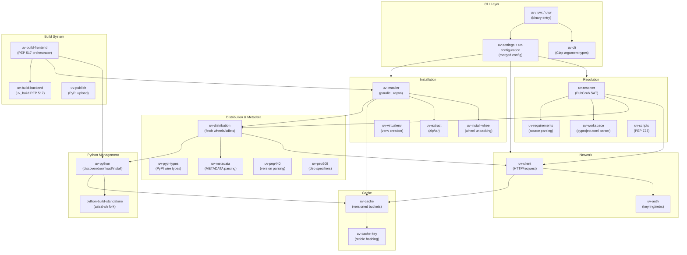

# uv — Complete Research Report

> **Repository:** [astral-sh/uv](https://github.com/astral-sh/uv)  
> **Research date:** 2026-05-18  
> **uv version at time of research:** 0.11.14  

---

## Executive Summary

`uv` is an extremely fast Python package and project manager written in Rust by Astral (the makers of `ruff`). It replaces an entire ecosystem of Python tooling — `pip`, `pip-tools`, `pipx`, `poetry`, `pyenv`, `twine`, and `virtualenv` — with a single binary that runs **10–100× faster** than `pip`[^1]. With 85,000+ GitHub stars and active weekly releases, uv has become the de-facto modern Python toolchain. It is architected as a 65+ crate Cargo workspace, uses a forking PubGrub resolver for universal cross-platform dependency resolution, stores all results in a versioned global cache using hardlinks/reflinking for disk efficiency, and publishes pre-built binaries for all major platforms. It is dual-licensed MIT/Apache-2.0[^2].

---

## Table of Contents

1. [Repository Overview](#1-repository-overview)
2. [Installation](#2-installation)
3. [Core Concepts & Feature Set](#3-core-concepts--feature-set)
4. [Project Management](#4-project-management)
5. [Python Version Management](#5-python-version-management)
6. [Dependency Resolution](#6-dependency-resolution)
7. [The pip-Compatible Interface](#7-the-pip-compatible-interface)
8. [Tools & Scripts (uvx / PEP 723)](#8-tools--scripts-uvx--pep-723)
9. [Workspaces](#9-workspaces)
10. [Package Publishing & Build Backend](#10-package-publishing--build-backend)
11. [Caching Architecture & Performance](#11-caching-architecture--performance)
12. [Configuration System](#12-configuration-system)
13. [Codebase Architecture](#13-codebase-architecture)
14. [CI/CD Integration](#14-cicd-integration)
15. [Docker Integration](#15-docker-integration)
16. [Platform & Version Policies](#16-platform--version-policies)
17. [Architecture Diagram](#17-architecture-diagram)
18. [Key Repositories](#18-key-repositories)
19. [Confidence Assessment](#19-confidence-assessment)
20. [Footnotes](#footnotes)

---

## 1. Repository Overview

| Field | Value |
|---|---|
| **Repository** | `astral-sh/uv` |
| **Description** | An extremely fast Python package and project manager, written in Rust |
| **Homepage** | https://docs.astral.sh/uv |
| **Language** | Rust (95%+) |
| **Stars** | 85,118 ⭐ |
| **Forks** | 3,132 |
| **License** | Apache-2.0 AND MIT (dual-licensed) |
| **Created** | 2023-10-02 |
| **Latest Version** | 0.11.14 (2026-05-12) |
| **MSRV** | Rust 1.93.0 (2024 edition) |
| **Topics** | `packaging`, `python`, `resolver`, `uv` |

**Top-level directory structure:**[^3]

```
astral-sh/uv/
├── .cargo/           # Cargo configuration
├── .github/          # GitHub Actions CI workflows
├── assets/           # Images/badges used in README
├── changelogs/       # Per-release changelog fragments
├── crates/           # 65+ Rust crates (the entire source code)
├── docs/             # MkDocs documentation source → docs.astral.sh/uv
├── python/           # Python bindings / helper scripts
├── scripts/          # Development & release helper scripts
├── BENCHMARKS.md     # Benchmark methodology and methodology
├── CHANGELOG.md      # Full release history
├── Cargo.toml        # Rust workspace manifest
├── mkdocs.yml        # Documentation site config (MkDocs Material)
├── pyproject.toml    # Python project metadata (uv manages itself)
├── uv.lock           # uv's own lockfile — it dogfoods itself
└── uv.schema.json    # JSON Schema for uv configuration
```

---

## 2. Installation

uv is installable without Rust or Python as a standalone binary[^4]:

```bash
# macOS / Linux (standalone installer — recommended)
curl -LsSf https://astral.sh/uv/install.sh | sh

# Windows (standalone installer)
powershell -ExecutionPolicy ByPass -c "irm https://astral.sh/uv/install.ps1 | iex"

# Pin to specific version
curl -LsSf https://astral.sh/uv/0.11.14/install.sh | sh

# Via pip (no isolation)
pip install uv

# Via pipx (isolated — recommended for pip users)
pipx install uv

# Via Homebrew
brew install uv

# Via WinGet
winget install --id=astral-sh.uv -e

# Via Scoop
scoop install main/uv

# Via Cargo (from source)
cargo install --locked uv

# Self-update (standalone installs only)
uv self update
```

**Shell completions:**

```bash
# Bash
echo 'eval "$(uv generate-shell-completion bash)"' >> ~/.bashrc

# Zsh
echo 'eval "$(uv generate-shell-completion zsh)"' >> ~/.zshrc

# Fish
echo 'uv generate-shell-completion fish | source' > ~/.config/fish/completions/uv.fish

# PowerShell
Add-Content -Path $PROFILE -Value '(& uv generate-shell-completion powershell) | Out-String | Invoke-Expression'
```

**Uninstall:**[^4]

```bash
uv cache clean
rm -r "$(uv python dir)"
rm -r "$(uv tool dir)"
rm ~/.local/bin/uv ~/.local/bin/uvx   # macOS/Linux
```

---

## 3. Core Concepts & Feature Set

uv is described as **"a single tool to replace `pip`, `pip-tools`, `pipx`, `poetry`, `pyenv`, `twine`, `virtualenv`, and more."**[^1] Its headline capability areas are:

| Feature Area | Description | Replaced Tool(s) |
|---|---|---|
| **Project management** | `pyproject.toml`-based projects with lockfile | `poetry`, `pdm`, `pipenv` |
| **pip interface** | Drop-in replacement for pip commands | `pip`, `pip-tools` |
| **Python management** | Install/manage Python versions | `pyenv` |
| **Tool management** | Install/run CLI tools in isolation | `pipx` |
| **Script running** | PEP 723 inline-metadata scripts | `pipx run` |
| **Workspaces** | Multi-package monorepos | `poetry` (partial) |
| **Publishing** | Build and upload to PyPI | `twine`, `build` |
| **Virtual environments** | Create/manage venvs | `virtualenv`, `venv` |

---

## 4. Project Management

The **project interface** is the primary high-level workflow for managing Python applications and libraries[^5]:

```bash
# Create a new project
uv init my-app              # application (no build system)
uv init --lib my-lib        # library (with src layout + uv_build backend)
uv init --package my-pkg    # packaged app (with entry points)
uv init --bare my-bare      # minimal pyproject.toml only

# Manage dependencies
uv add requests             # add + update lockfile + sync env
uv add 'httpx[http2]'       # with extras
uv add 'ruff>=0.2'          # with version constraint
uv add --dev pytest         # dev dependency (goes to [dependency-groups])
uv add --group lint ruff    # named dependency group
uv add --optional docs mkdocs  # optional extra (published)
uv remove requests          # remove dependency

# Run in project environment (auto-syncs)
uv run python -m my_app
uv run pytest
uv run --python 3.12 pytest

# Lock and sync manually
uv lock                     # create/update uv.lock
uv lock --upgrade           # upgrade all to latest compatible
uv lock --upgrade-package requests  # upgrade single package
uv lock --check             # CI: fail if lockfile is stale
uv sync                     # sync venv to lockfile
uv sync --no-dev            # without dev dependencies
uv sync --locked            # error if lockfile is outdated

# Build and publish
uv build                    # build sdist + wheel to dist/
uv publish                  # publish to PyPI

# Inspect
uv tree                     # dependency tree
uv version --short          # print current version
uv version 1.0.0            # set version
uv version --bump minor     # bump minor version
```

### Project File Layout

```
my-app/
├── pyproject.toml      # Project metadata, dependencies, config
├── .python-version     # Pinned Python version
├── .venv/              # Auto-managed virtual environment
├── uv.lock             # Cross-platform lockfile (commit to VCS)
└── src/                # Source (for --lib / --package projects)
    └── my_app/
        └── __init__.py
```

### Dependency Fields[^6]

| Field | Standard | Published | Use Case |
|---|---|---|---|
| `[project.dependencies]` | PEP 621 | ✅ Yes | Core runtime deps |
| `[project.optional-dependencies]` | PEP 621 | ✅ Yes | Optional feature extras |
| `[dependency-groups]` | PEP 735 | ❌ No | Dev/test/lint tooling |
| `[tool.uv.sources]` | uv-specific | ❌ No | Dev-time alternative sources |

**Example `pyproject.toml`:**

```toml
[project]
name = "my-app"
version = "0.1.0"
requires-python = ">=3.11"
dependencies = [
    "httpx>=0.27.0",
    "rich>=13.0",
    "pydantic>=2.0; python_version >= '3.10'",
]

[project.optional-dependencies]
dev-server = ["uvicorn[standard]"]

[dependency-groups]
dev = ["pytest>=8.0", "ruff", { include-group = "typing" }]
typing = ["mypy>=1.8"]

[tool.uv.sources]
my-local-pkg = { path = "../packages/my-local-pkg", editable = true }
torch = { index = "pytorch-cpu" }

[[tool.uv.index]]
name = "pytorch-cpu"
url = "https://download.pytorch.org/whl/cpu"
explicit = true
```

---

## 5. Python Version Management

uv downloads and manages Python versions directly — no `pyenv` needed[^7]:

```bash
# Install Python versions
uv python install 3.12        # latest 3.12.x
uv python install 3.11 3.12 3.13    # multiple versions
uv python install pypy@3.10   # PyPy
uv python install 3.13t       # free-threaded CPython
uv python install 3.13+debug  # debug build

# List available and installed
uv python list                # all available versions
uv python list --only-installed  # only installed

# Pin project Python version
uv python pin 3.12            # creates .python-version file
uv python pin --global 3.12   # in ~/.config/uv/.python-version

# Find an interpreter
uv python find 3.12
uv python find pypy

# Create venv with specific version
uv venv --python 3.12.0

# Run with specific version
uv run --python 3.11 my_script.py

# Upgrade managed Python
uv python upgrade 3.12        # installs latest 3.12.x patch, updates symlink
```

### Supported Python Distributions[^7]

| Implementation | Managed Downloads | Short Name |
|---|---|---|
| **CPython** | ✅ Yes | `cp` or `cpython` |
| **PyPy** | ✅ Yes | `pp` or `pypy` |
| **Pyodide** (WebAssembly) | ✅ Yes | `pyodide` |
| **GraalPy** | ❌ Discovery only | `gp` or `graalpy` |

### CPython Variants

```bash
uv python install 3.13         # Default (PGO+LTO optimized)
uv python install 3.13t        # Free-threaded (no-GIL, PEP 703)
uv python install 3.13+debug   # Debug build (-UNDEBUG)
uv python install 3.14+gil     # Explicit GIL-enabled (3.14+)
```

### Source: python-build-standalone

CPython distributions come from [astral-sh/python-build-standalone](https://github.com/astral-sh/python-build-standalone) — a fork of `indygreg/python-build-standalone` that provides pre-built CPython tarballs with PGO+LTO optimization. The available versions are bundled in a 2.7 MB `download-metadata.json` file that ships with each uv release[^7].

**Download URL pattern:**
```
https://github.com/astral-sh/python-build-standalone/releases/download/{YYYYMMDD}/
  cpython-{version}+{YYYYMMDD}-{arch}-{os}-{libc}-install_only_stripped.tar.gz
```

### Python Discovery Order

When uv needs a Python interpreter, it searches in this order[^7]:
1. Explicit `--python` argument
2. `VIRTUAL_ENV` environment variable (active venv)
3. `CONDA_PREFIX` environment variable
4. Discovered `.venv` in current dir or parents
5. `PATH` search
6. Windows PEP 514 registry
7. Microsoft Store
8. Managed installations (`~/.local/share/uv/python/`)

**Preference control:**
```bash
UV_PYTHON_PREFERENCE=managed    # prefer uv-managed (default)
UV_PYTHON_PREFERENCE=system     # prefer system Python
--managed-python                # only managed Python
--no-managed-python             # only system Python
UV_PYTHON_DOWNLOADS=manual      # no automatic downloads
```

---

## 6. Dependency Resolution

### Algorithm: PubGrub

uv uses `astral-pubgrub` (a fork of the PubGrub incremental SAT-based resolver) via the `uv-resolver` crate[^8]. PubGrub guarantees that if a valid resolution exists, it will find it — and if not, it produces a human-readable explanation of the conflict.

**Key resolver behaviors:**
- Prefetches package metadata in the background concurrently
- Assumes all wheels of a package version share identical `METADATA` (allows single fetch per version vs. 73+ for numpy)
- Forks the resolution tree when environment-conditional requirements exist (different numpy for Py3.8 vs Py3.12)
- Selects **latest compatible version** by default

### Resolution Modes

| Mode | Command | Use Case |
|---|---|---|
| **Universal** (cross-platform) | `uv lock` (default) | `uv.lock` — works on all platforms/Python versions |
| **Platform-specific** | `uv pip compile` (default) | `requirements.txt` for current platform only |
| **Cross-compile** | `uv pip compile --python-platform linux --python-version 3.10` | Generate for a different platform |

**Universal resolution with fork strategy:**[^9]

```toml
[tool.uv]
# requires-python (default): latest version per Python release series
# fewest: minimize total number of selected versions
fork-strategy = "requires-python"
```

Result: different package versions per Python version marker in `uv.lock`:
```
numpy==1.24.4 ; python_version == "3.8"
numpy==2.2.0 ; python_version >= "3.10"
```

### Lock File (`uv.lock`)[^9]

```toml
# uv.lock — TOML format, universal, cross-platform
# Generated by uv, not for manual editing
# MUST be committed to VCS

version = 1
requires-python = ">=3.11"

[[package]]
name = "requests"
version = "2.31.0"
source = { registry = "https://pypi.org/simple" }
sdist = { url = "...", hash = "sha256:..." }
wheels = [
    { url = "...", hash = "sha256:...", filename = "..." },
]
```

**Lock commands:**
```bash
uv lock               # create/update
uv lock --check       # CI: fail if stale (--locked equivalent)
uv lock --upgrade     # upgrade all packages
uv lock --upgrade-package httpx  # upgrade single package
uv run --locked       # error if lockfile is outdated
uv run --frozen       # skip freshness check entirely
```

### Resolution Strategy Options[^9]

```bash
uv pip compile --resolution latest          # default: highest compatible
uv pip compile --resolution lowest          # lowest compatible (for testing lower bounds)
uv pip compile --resolution lowest-direct   # lowest for direct, latest for transitive
```

### Constraints vs. Overrides[^9]

```bash
# Constraints: narrow range, package not installed unless already a dep
uv pip compile requirements.in --constraint constraints.txt

# Overrides: absolutely replace requirements (can expand ranges)
uv pip compile requirements.in --override overrides.txt
```

### Pre-release Handling

Pre-releases are accepted **automatically** only if:
1. The package is a direct dependency with a pre-release specifier (`flask>=2.0.0rc1`)
2. **All** published versions of a package are pre-releases

Otherwise: use `--prerelease allow`[^9]

### Excluding Old Releases

```bash
uv pip compile --exclude-newer 2023-10-16   # only packages before this date
```

---

## 7. The pip-Compatible Interface

The `uv pip` subcommand provides a **drop-in replacement** for pip/pip-tools workflows[^10]:

```bash
# Package installation
uv pip install flask
uv pip install 'flask[dotenv]'
uv pip install 'ruff>=0.2.0'
uv pip install "git+https://github.com/astral-sh/ruff@v0.2.0"
uv pip install -e .                       # editable
uv pip install -r requirements.txt
uv pip install -r pyproject.toml --extra foo

# Uninstall
uv pip uninstall flask

# List / inspect
uv pip list
uv pip show flask
uv pip freeze
uv pip check                             # verify environment consistency
uv pip tree                             # dependency tree

# Virtual environments
uv venv                                  # creates .venv
uv venv --python 3.12                    # with specific Python

# Compile (pip-tools style)
uv pip compile requirements.in -o requirements.txt
uv pip compile requirements.in --universal    # cross-platform output
uv pip compile --python-platform linux --python-version 3.10 requirements.in

# Sync (pip-sync style)
uv pip sync requirements.txt            # exact sync (removes unlisted packages)
```

### Key pip Compatibility Differences[^10]

| Behavior | pip | uv |
|---|---|---|
| Requires virtual env | No (uses system) | **Yes** — uses `.venv` by default |
| Config files | `pip.conf` | Does NOT read `pip.conf` — uses `uv.toml` + `UV_*` env vars |
| Pre-releases | Allows if transitive deps require | Requires `--prerelease allow` opt-in |
| Multiple indexes | Merges all (unsafe) | First-index strategy (prevents dependency confusion) |
| Build isolation | Optional | **On by default** (PEP 517) |
| Bytecode (`.pyc`) | Created by default | NOT created — use `--compile-bytecode` |
| `--user` flag | Supported | **Not supported** |
| Install to system | Default | Requires `--system` flag |

**Install to system Python:**
```bash
uv pip install --system flask       # explicit opt-in
UV_SYSTEM_PYTHON=1 uv pip install flask
```

---

## 8. Tools & Scripts (uvx / PEP 723)

### Tool Management (like pipx)[^11]

`uvx` is an alias for `uv tool run` — it runs tools ephemerally in cached isolated environments:

```bash
# Ephemeral run (cached virtual env, auto-created)
uvx ruff check .
uvx --from httpie http GET https://example.com
uvx ruff@0.3.0 check .              # pin exact version
uvx ruff@latest check .             # force-refresh to latest
uvx --with mkdocs-material mkdocs serve  # extra deps without changing tool
uvx --python 3.10 ruff check .

# Install tool persistently (symlinked to PATH)
uv tool install ruff
uv tool install 'ruff>=0.2.0'
uv tool install ruff==0.5.0
uv tool install mkdocs --with mkdocs-material
uv tool install git+https://github.com/httpie/cli

# Multi-tool environments
uv tool install --with-executables-from ansible-core ansible

# Upgrade
uv tool upgrade ruff
uv tool upgrade --all

# List / remove
uv tool list
uv tool uninstall ruff

# Setup PATH
uv tool update-shell
```

**uvx vs pipx feature comparison:**[^11]

| Feature | pipx | uv tools |
|---|---|---|
| Ephemeral one-off run | ✅ | ✅ `uvx` (with caching) |
| Install to PATH | ✅ | ✅ `uv tool install` |
| Version pinning | ✅ | ✅ `uvx ruff@0.3.0` |
| Upgrade all | ✅ | ✅ `uv tool upgrade --all` |
| Per-tool Python version | ✅ | ✅ `--python 3.10` |
| PEP 723 inline scripts | ❌ | ✅ Full support |
| Dependency locking | ❌ | ✅ `uv lock --script` |
| Speed | Slow (pip) | **10–100× faster** |
| Multi-tool environments | ❌ | ✅ `--with-executables-from` |

### PEP 723 Inline Script Dependencies[^11]

Embed dependency metadata directly in Python scripts:

```bash
# Initialize a script
uv init --script example.py --python 3.12

# Add dependencies (modifies the file's TOML header)
uv add --script example.py 'requests<3' 'rich'
```

The script becomes:
```python
#!/usr/bin/env -S uv run --script
# /// script
# requires-python = ">=3.12"
# dependencies = [
#   "requests<3",
#   "rich",
# ]
# [tool.uv]
# exclude-newer = "2023-10-16T00:00:00Z"   # for reproducibility
# ///

import requests
from rich.pretty import pprint
response = requests.get("https://peps.python.org/api/peps.json")
pprint(response.json())
```

```bash
# Run: uv auto-creates isolated env, installs deps
uv run example.py

# Make executable
chmod +x example.py && ./example.py   # works with the shebang line

# Lock script dependencies
uv lock --script example.py     # creates example.py.lock

# Add private index to script
uv add --index "https://example.com/simple" --script example.py 'mypackage'
```

---

## 9. Workspaces

Workspaces allow multiple Python packages to share a **single lockfile** in a monorepo — directly inspired by Cargo workspaces[^6]:

```toml
# Workspace root pyproject.toml
[tool.uv.workspace]
members = ["packages/*"]       # glob pattern — all must have pyproject.toml
exclude = ["packages/seeds"]   # optional exclusions
```

**Example workspace layout:**
```
albatross/                    ← workspace root (also a member)
├── packages/
│   ├── bird-feeder/          ← workspace member
│   │   ├── pyproject.toml
│   │   └── src/bird_feeder/
│   └── seeds/                ← excluded
├── pyproject.toml            ← [tool.uv.workspace] lives here
├── uv.lock                   ← SHARED lockfile for ALL members
└── src/albatross/
```

**Workspace-relative cross-dependencies:**
```toml
# In bird-feeder/pyproject.toml
[project]
dependencies = ["albatross"]

[tool.uv.sources]
albatross = { workspace = true }   # resolves to workspace root member, not PyPI
```

**Key workspace properties:**[^6]
- All members share a single `uv.lock` at the workspace root
- Inter-workspace dependencies are always installed as **editable**
- `uv run --package bird-feeder pytest` — run in context of a specific member
- All members' `requires-python` ranges are **intersected** for resolution
- Config in `[tool.uv]` at workspace root propagates to all members

**When NOT to use workspaces:**
- Members with conflicting requirements
- Need separate virtual environments per member
- Testing across Python versions that conflict with another member's `requires-python`

---

## 10. Package Publishing & Build Backend

### Building Distributions[^12]

```bash
uv build               # both sdist + wheel → dist/
uv build --sdist       # source distribution only
uv build --wheel       # wheel only
uv build --no-sources  # disables tool.uv.sources (for publishing compatibility)
uv build path/to/project
uv build --package my-lib  # specific workspace member
```

### Publishing[^12]

```bash
# PyPI via API token
uv publish --token $PYPI_TOKEN

# Via environment variables (CI)
UV_PUBLISH_TOKEN=$PYPI_TOKEN uv publish

# Trusted Publishing / OIDC (no credentials needed in GitHub Actions)
uv publish

# Custom / private registry
uv publish --index my-registry
```

**Configure custom registries in `pyproject.toml`:**
```toml
[[tool.uv.index]]
name = "my-registry"
url = "https://my-registry.example.com/simple/"
publish-url = "https://my-registry.example.com/upload/"
explicit = true
```

**Prevent accidental public publishing:**
```toml
[project]
classifiers = ["Private :: Do Not Upload"]  # PyPI will reject this
```

### The `uv_build` Build Backend[^12]

uv ships its own PEP 517-compliant build backend for pure Python packages:

```toml
[build-system]
requires = ["uv_build>=0.11.14,<0.12"]
build-backend = "uv_build"
```

**Supported vs. unsupported:**

| Feature | Supported |
|---|---|
| Pure Python packages | ✅ |
| Namespace packages | ✅ `module-name = "foo.bar"` |
| Multiple root modules | ✅ `module-name = ["foo", "bar"]` |
| Stub packages (`-stubs`) | ✅ |
| PEP 660 editable installs | ✅ |
| Extension modules (C/Rust) | ❌ Use maturin / scikit-build-core |
| Custom build scripts | ❌ Use hatchling |

The `uv` binary **bundles a copy** of `uv_build` — if the bundled version is compatible, no download occurs during `uv build`.

### Version Management[^12]

```bash
uv version 1.0.0                    # set exact version
uv version --bump minor             # 1.2.3 → 1.3.0
uv version --bump patch             # 1.3.0 → 1.3.1
uv version --bump beta              # 1.3.0 → 1.3.1b1
uv version --bump stable            # 1.3.1b2 → 1.3.1 (strip pre-release)
uv version 2.0.0 --dry-run         # preview only
```

### Export Formats[^12]

```bash
uv export --format requirements.txt         # pip-compatible
uv export --format pylock.toml              # PEP 751 standard
uv export --format cyclonedx1.5            # CycloneDX SBOM (preview)
```

---

## 11. Caching Architecture & Performance

### Cache Layout[^13]

| Platform | Default Cache Path |
|---|---|
| Linux / macOS | `$HOME/.cache/uv` |
| Windows | `%LOCALAPPDATA%\uv\cache` |

Override: `UV_CACHE_DIR`, `--cache-dir`, or `tool.uv.cache-dir`.

The cache is organized into **versioned buckets** — if a release changes the cache format for a bucket, old/new uv versions can coexist safely. Each bucket is independently versioned[^13].

### Installation Strategy (Disk Efficiency)

| Platform | Strategy | Effect |
|---|---|---|
| macOS (APFS) | **Reflinking** (CoW clone) | Near-zero-copy, near-instantaneous |
| Linux (same FS) | **Hardlinking** | Single inode shared across all envs |
| Cross-filesystem | File copy | Fallback (slower, avoid) |

This means a wheel cached once is shared across all projects — no per-project duplication.

### What Gets Cached[^13]

| Dependency Type | Cache Invalidation |
|---|---|
| Registry packages (PyPI) | HTTP `ETag` / `Cache-Control` / `Last-Modified` |
| Direct URL dependencies | HTTP headers + URL identity |
| Git dependencies | Fully resolved commit SHA |
| Local archives | File last-modified timestamp |
| Local directories (editable) | `pyproject.toml` / `setup.py` last-modified |
| Script environments | Per `example.py.lock` lockfile hash |

### Dynamic Cache Keys[^13]

For packages with dynamic metadata (e.g., `setuptools-scm`):

```toml
[tool.uv]
cache-keys = [
    { file = "pyproject.toml" },
    { git = { commit = true, tags = true } },
    { env = "MY_BUILD_VAR" },
    { dir = "src" },
    { file = "**/*.toml" },   # glob
]
```

### Cache Management[^13]

```bash
uv cache clean                     # remove all cache entries
uv cache clean ruff                # remove single package
uv cache prune                     # remove only unused entries
uv cache prune --ci                # CI-optimized: keeps source-built wheels, removes pre-built
uv cache dir                       # print cache path

# Per-invocation controls
uv sync --refresh                  # revalidate all cached data
uv sync --refresh-package httpx    # revalidate single package
uv sync --no-cache                 # use temporary cache only
```

**Recommended CI pattern:**
```yaml
# At end of CI job — prune unnecessary cache entries before saving
- run: uv cache prune --ci
```

### Performance Benchmarks[^13]

Benchmarks use `hyperfine` on macOS against `pip-compile`, `poetry`, `pdm`:

| Scenario | What It Measures |
|---|---|
| Warm installation | Recreate `.venv` with pre-downloaded packages |
| Cold installation | Full install on new machine (no cache) |
| Warm resolution | Regenerate `requirements.txt` (cache warm) |
| Cold resolution | First-run resolution (no cache) |

Claimed performance: **10–100× faster than pip** for typical use cases[^1]. The exact margin varies by:
- Filesystem (macOS reflinks ≫ Linux hardlinks ≫ cross-fs copy)
- Package mix (source distributions that need building narrow the gap)
- Cache temperature (warm cache is most dramatically faster)

### Concurrency Safety[^13]

> "It's safe to run multiple uv commands concurrently, even against the same virtual environment. uv's cache is designed to be thread-safe and append-only."

- Cache-modifying commands (`clean`, `prune`) are blocked while other uv commands run
- Default lock timeout: **5 minutes** (`UV_LOCK_TIMEOUT`)

---

## 12. Configuration System

### Configuration File Hierarchy[^14]

```
CLI flags / env vars (UV_*)
    ↓
Project: ./uv.toml  OR  ./pyproject.toml [tool.uv]
    ↓
User: ~/.config/uv/uv.toml
    ↓
System: /etc/uv/uv.toml  (or C:\ProgramData\uv\uv.toml on Windows)
```

**Key rules:**
- `uv.toml` takes **precedence over** `pyproject.toml [tool.uv]` when both exist in the same directory
- User/system config must use `uv.toml` format only (not `pyproject.toml`)
- For `uv tool` commands, **project-level config is ignored** — only user/system config applies
- In a workspace, config is read from the workspace root; member-level config is ignored
- Arrays are **concatenated** (project entries first); scalars use higher-precedence value
- `--no-config` disables all file-based config discovery

### Example Configurations[^14]

**Project `pyproject.toml`:**
```toml
[tool.uv]
python-preference = "managed"
compile-bytecode = false

[[tool.uv.index]]
name = "internal"
url = "https://internal.example.com/simple/"
default = true

[tool.uv.pip]
# Only affects `uv pip` subcommands, not uv sync/lock/run
index-url = "https://test.pypi.org/simple/"
```

**User `~/.config/uv/uv.toml`:**
```toml
python-downloads = "manual"    # no automatic downloads
cache-dir = "/mnt/large-disk/.uv-cache"
```

**Dotenv files** (for `uv run`):[^14]
```bash
uv run --env-file .env my_script.py
UV_ENV_FILE=.env uv run my_script.py
```

Shell environment variables **always take precedence** over `.env` file values.

### Storage Locations[^13]

| Type | Linux/macOS | Windows |
|---|---|---|
| **Cache** | `~/.cache/uv` | `%LOCALAPPDATA%\uv\cache` |
| **Data (tools, Python)** | `~/.local/share/uv` | `%APPDATA%\uv\data` |
| **User config** | `~/.config/uv/uv.toml` | `%APPDATA%\uv\uv.toml` |
| **System config** | `/etc/uv/uv.toml` | `%PROGRAMDATA%\uv\uv.toml` |
| **Executables** | `~/.local/bin` | `%USERPROFILE%\.local\bin` |
| **Tool envs** | `~/.local/share/uv/tools` | `%APPDATA%\uv\data\tools` |
| **Python installs** | `~/.local/share/uv/python` | `%APPDATA%\uv\data\python` |

---

## 13. Codebase Architecture

uv is structured as a **Cargo workspace** with 65+ first-party `uv-*` crates, each with a single focused responsibility[^8]:

### Crate Layer Map

```
┌─────────────────────────────────────────────────────────────────┐
│                    CLI & Dispatch Layer                         │
│  uv (main binary) │ uv-cli │ uv-dispatch │ uv-configuration    │
│  uv-settings │ uv-preview │ uv-static │ uv-warnings           │
├─────────────────────────────────────────────────────────────────┤
│                    Resolution Layer                             │
│  uv-resolver (PubGrub) │ uv-requirements │ uv-workspace        │
│  uv-requirements-txt │ uv-scripts │ uv-types (trait bridge)    │
├─────────────────────────────────────────────────────────────────┤
│                 Distribution & Metadata Layer                   │
│  uv-distribution │ uv-distribution-types │ uv-pypi-types       │
│  uv-metadata │ uv-pep440 │ uv-pep508 │ uv-normalize           │
│  uv-platform-tags │ uv-distribution-filename                   │
├─────────────────────────────────────────────────────────────────┤
│                      Network Layer                              │
│  uv-client (HTTP/reqwest) │ uv-auth │ uv-keyring │ uv-netrc   │
├─────────────────────────────────────────────────────────────────┤
│                    Installation Layer                           │
│  uv-installer │ uv-install-wheel │ uv-extract │ uv-virtualenv  │
├─────────────────────────────────────────────────────────────────┤
│                   Build System Layer                            │
│  uv-build-backend │ uv-build-frontend │ uv-publish │ uv-audit  │
├─────────────────────────────────────────────────────────────────┤
│                 Python Management Layer                         │
│  uv-python │ uv-tool │ uv-bin-install                          │
├─────────────────────────────────────────────────────────────────┤
│                      Caching Layer                              │
│  uv-cache │ uv-cache-info │ uv-cache-key                       │
├─────────────────────────────────────────────────────────────────┤
│                 Platform & OS Utilities                         │
│  uv-fs │ uv-dirs │ uv-shell │ uv-unix │ uv-windows │ uv-git   │
├─────────────────────────────────────────────────────────────────┤
│                    Shared Utilities                             │
│  uv-pep440 │ uv-pep508 │ uv-normalize │ uv-once-map            │
│  uv-small-str │ uv-version │ uv-redacted │ uv-globfilter       │
└─────────────────────────────────────────────────────────────────┘
```

### Complete Crate Inventory[^8]

**CLI & Dispatch Layer:**

| Crate | Purpose |
|---|---|
| `uv` | Main binary; orchestrates everything; `main()` entry point |
| `uv-cli` | All Clap CLI types (`Cli`, `Commands`, subcommand structs) |
| `uv-dispatch` | Coordinates resolving + building sdists in isolated envs |
| `uv-configuration` | Shared config structs passed through the stack |
| `uv-settings` | User-facing settings from `uv.toml`/`pyproject.toml` |
| `uv-preview` | Preview-feature gating (`PreviewFeature` enum) |
| `uv-static` | Compile-time constants (e.g., all `UV_*` env var names) |
| `uv-warnings` | User-facing warning infrastructure (`warn_user!`) |
| `uv-logging` | `tracing`/`tracing-subscriber` setup |
| `uv-console` | Terminal output helpers |

**Resolution Layer:**

| Crate | Purpose |
|---|---|
| `uv-resolver` | Core dependency resolver — PubGrub SAT solving, lockfile production |
| `uv-requirements` | Reads `pyproject.toml`, `requirements.txt`, `pylock.toml` |
| `uv-requirements-txt` | Parser for `requirements.txt` format |
| `uv-workspace` | Workspace discovery, `pyproject.toml` parsing, `uv.toml` merging |
| `uv-scripts` | PEP 723 inline script metadata parsing |
| `uv-types` | Shared trait definitions to avoid circular deps |
| `uv-torch` | PyTorch-specific index URL logic (CUDA/ROCm selection) |

**Network Layer:**

| Crate | Purpose |
|---|---|
| `uv-client` | HTTP client (reqwest + retry + middleware, range requests, TLS) |
| `uv-auth` | Authentication middleware (keyring, netrc, credential store) |
| `uv-keyring` | Platform keyring integration (Linux secret-service, macOS Keychain, Windows Credential Manager) |
| `uv-netrc` | `.netrc` file parser |

**Installation Layer:**

| Crate | Purpose |
|---|---|
| `uv-installer` | High-level wheel installation (plan, link, copy, compile via `rayon`) |
| `uv-install-wheel` | Low-level wheel unpacking (RECORD writing, script shims) |
| `uv-extract` | Archive extraction (zip, tar.gz, tar.bz2, tar.xz, tar.zst) |
| `uv-virtualenv` | Virtual environment creation |
| `uv-trampoline-builder` | Builds Windows `.exe` script trampolines |

**Build System Layer:**

| Crate | Purpose |
|---|---|
| `uv-build-backend` | uv's own PEP 517 build backend (pure Python packages) |
| `uv-build-frontend` | PEP 517 frontend — invokes backends in isolated envs |
| `uv-publish` | `uv publish` — uploads distributions to PyPI/registries |
| `uv-audit` | `uv audit` — vulnerability scanning (CycloneDX SBOM) |

### Key External Dependencies[^8]

| Dependency | Version | Role |
|---|---|---|
| `astral-pubgrub` | 0.3.3 | Core SAT-based version resolver |
| `tokio` | 1.40.0 | Async runtime |
| `reqwest` | 0.13.1 | HTTP client (rustls, HTTP/2, streaming) |
| `clap` | 4.5.17 | CLI argument parsing |
| `rkyv` | 0.8.14 | Zero-copy serialisation for cache entries |
| `petgraph` | 0.8.0 | Directed graph (dependency graph, topological sort) |
| `rayon` | 1.10.0 | Parallel wheel installation |
| `toml_edit` | 0.25.8 | In-place TOML editing (`uv add`/`uv remove`) |
| `dashmap` | 6.1.0 | Concurrent hash map in resolver |
| `astral_async_http_range_reader` | 0.11.0 | Streaming partial-zip reads for lazy wheel metadata |
| `insta` | 1.46.0 | Snapshot testing |
| `miette` | 7.2.0 | Fancy diagnostic error reporting |
| `cyclonedx-bom` | 0.8.1 | SBOM generation for `uv audit` |
| `axoupdater` | 0.10.0 | Self-update mechanism |

### Binary Structure[^8]

```rust
// Three binaries in the uv crate:
// bin/uv.rs    — main `uv` binary
// bin/uvx.rs   — `uvx` alias (rewrites args to `uv tool run`)
// bin/uvw.rs   — Windows GUI binary (feature-gated)

fn main() -> ExitCode {
    unsafe { uv_main(std::env::args_os()) }
}
```

**Command dispatch in `lib.rs::run()`:**
```
Commands::Project(cmd)  →  uv::{init, add, remove, sync, lock, run, tree, export}
Commands::Pip(cmd)      →  uv pip::{compile, sync, install, uninstall, freeze, list, show, check, tree}
Commands::Tool(cmd)     →  uv tool::{run, install, uninstall, list, update-shell, dir}
Commands::Python(cmd)   →  uv python::{install, uninstall, list, find, pin, dir}
Commands::Build(cmd)    →  uv build
Commands::Publish(cmd)  →  uv publish
Commands::Cache(cmd)    →  uv cache::{clean, prune, dir, size}
Commands::Self_(cmd)    →  uv self::{update, version}
Commands::Auth(cmd)     →  uv auth::{login, logout}
Commands::Venv(cmd)     →  uv venv
```

---

## 14. CI/CD Integration

### GitHub Actions with `setup-uv`[^15]

```yaml
- name: Install uv
  uses: astral-sh/setup-uv@08807647e7069bb48b6ef5acd8ec9567f424441b  # v8.1.0
  with:
    version: "0.11.14"        # pin to specific version
    enable-cache: true        # persist uv package cache
    prune-cache: true         # CI-optimized prune before saving
    python-version: ${{ matrix.python-version }}  # for matrix builds

- name: Install project
  run: uv sync --locked --all-extras --dev

- name: Run tests
  run: uv run pytest tests/
```

**Matrix testing:**
```yaml
strategy:
  matrix:
    python-version: ["3.10", "3.11", "3.12", "3.13"]
steps:
  - uses: astral-sh/setup-uv@...
    with:
      python-version: ${{ matrix.python-version }}
  - run: uv run pytest
```

**Publishing with OIDC Trusted Publishing (no secrets needed):**
```yaml
on:
  push:
    tags: [v*]
jobs:
  publish:
    permissions:
      id-token: write    # Required for OIDC
    steps:
      - uses: actions/checkout@v4
      - uses: astral-sh/setup-uv@...
      - run: uv build
      - run: uv publish    # OIDC auto-detected
```

### `setup-uv` Action Inputs (Key Ones)[^15]

| Input | Default | Description |
|---|---|---|
| `version` | auto-detect | uv version (reads from `uv.toml` `required-version` or uses latest) |
| `python-version` | none | Sets `UV_PYTHON` for entire workflow |
| `enable-cache` | `"auto"` | Cache uv package cache (`auto` = on for GitHub-hosted runners) |
| `prune-cache` | `"true"` | Run `uv cache prune --ci` before saving |
| `cache-dependency-glob` | `**/uv.lock` + `**/*.txt` | Files that invalidate cache key |
| `activate-environment` | `"false"` | Create+activate `.venv` for subsequent steps |
| `cache-python` | `"false"` | Also cache managed Python installations |
| `working-directory` | repo root | Monorepo subdirectory containing `pyproject.toml` |

### Using pip Interface in CI[^15]

```yaml
env:
  UV_SYSTEM_PYTHON: 1    # use GitHub runner's Python, not venv

steps:
  - run: uv pip install -r requirements.txt
  - run: uv pip install -e ".[dev]"
```

### Manual Cache with `actions/cache`[^15]

```yaml
env:
  UV_CACHE_DIR: /tmp/.uv-cache

steps:
  - uses: actions/cache@v5
    with:
      path: /tmp/.uv-cache
      key: uv-${{ runner.os }}-${{ hashFiles('uv.lock') }}
      restore-keys: uv-${{ runner.os }}

  # ... build/test steps ...

  - run: uv cache prune --ci    # prune before saving
```

---

## 15. Docker Integration

### Official Docker Images[^16]

**Distroless (binary only — for `COPY --from`):**
```
ghcr.io/astral-sh/uv:latest
ghcr.io/astral-sh/uv:0.11.14          # pinned by version
ghcr.io/astral-sh/uv:0.8              # latest patch in 0.8.x series
ghcr.io/astral-sh/uv@sha256:<hash>    # SHA pin (maximum reproducibility)
```

**Derived images (uv pre-installed):**
```
ghcr.io/astral-sh/uv:alpine              # Alpine 3.23
ghcr.io/astral-sh/uv:debian-slim         # Debian Trixie Slim
ghcr.io/astral-sh/uv:python3.12-alpine   # Python 3.12 + Alpine
ghcr.io/astral-sh/uv:python3.12-trixie-slim  # Python 3.12 + Debian Slim
# Available for Python 3.9 through 3.14
```

### Install uv in Dockerfile[^16]

```dockerfile
# Method 1 — Binary copy (recommended)
FROM python:3.12-slim
COPY --from=ghcr.io/astral-sh/uv:0.11.14 /uv /uvx /bin/

# Method 2 — SHA256 pin (maximum security)
COPY --from=ghcr.io/astral-sh/uv@sha256:2381d6aa60... /uv /uvx /bin/

# Method 3 — installer script
RUN apt-get install -y curl ca-certificates
ADD https://astral.sh/uv/0.11.14/install.sh /uv-installer.sh
RUN sh /uv-installer.sh && rm /uv-installer.sh
ENV PATH="/root/.local/bin/:$PATH"
```

### Recommended Dockerfile Pattern (Layer-Optimized)[^16]

```dockerfile
FROM python:3.12-slim
COPY --from=ghcr.io/astral-sh/uv:0.11.14 /uv /uvx /bin/

WORKDIR /app

# LAYER 1: Install dependencies only (cached when uv.lock/pyproject.toml unchanged)
RUN --mount=type=cache,target=/root/.cache/uv \
    --mount=type=bind,source=uv.lock,target=uv.lock \
    --mount=type=bind,source=pyproject.toml,target=pyproject.toml \
    uv sync --locked --no-install-project

# LAYER 2: Install project (fast — re-runs only when source changes)
COPY . /app
RUN --mount=type=cache,target=/root/.cache/uv \
    uv sync --locked

CMD ["uv", "run", "my-app"]
```

### Multi-Stage Pattern (Minimal Final Image)[^16]

```dockerfile
# Builder: compiles everything
FROM python:3.12-slim AS builder
COPY --from=ghcr.io/astral-sh/uv:latest /uv /uvx /bin/
ENV UV_PYTHON_DOWNLOADS=0    # use system Python

WORKDIR /app
RUN --mount=type=cache,target=/root/.cache/uv \
    --mount=type=bind,source=uv.lock,target=uv.lock \
    --mount=type=bind,source=pyproject.toml,target=pyproject.toml \
    uv sync --locked --no-install-project --no-editable
COPY . /app
RUN --mount=type=cache,target=/root/.cache/uv \
    uv sync --locked --no-editable

# Final: only contains the venv — no uv, no source code
FROM python:3.12-slim
COPY --from=builder /app/.venv /app/.venv
CMD ["/app/.venv/bin/my-app"]
```

### Key Docker Environment Variables[^16]

```dockerfile
ENV UV_LINK_MODE=copy          # avoid cross-filesystem link warnings
ENV UV_COMPILE_BYTECODE=1      # compile .pyc for faster startup
ENV UV_PYTHON_DOWNLOADS=0      # skip Python auto-download (use base image Python)
ENV UV_PROJECT_ENVIRONMENT=/app/.venv  # explicit venv path
```

---

## 16. Platform & Version Policies

### Platform Support Tiers[^14]

| Tier | Guarantee | Platforms |
|---|---|---|
| **Tier 1** | Continuously built + tested | macOS Apple Silicon, macOS x86_64, Linux x86_64, Windows x86_64 |
| **Tier 2** | Continuously built; tests NOT run | Linux: PPC64LE, RISC-V64, aarch64, armv7, i686, s390x; Windows arm64 |
| **Tier 3** | Best-effort; patches accepted | FreeBSD x86_64, Windows i686 |

**Minimum OS versions:**
- Windows 10 / Windows Server 2016 (follows Rust Tier 1)
- macOS 13 (Ventura) official; macOS 12 works but needs `realpath`

**Linux:** Ships both glibc (`manylinux`-compatible, glibc 2.17+ for x86_64) and musl (statically linked) binaries.

### Versioning Policy[^14]

```
uv uses a custom semver variant:
  MINOR version bump → breaking changes
  PATCH version bump → bug fixes, enhancements, non-breaking changes

Published stable crates: uv, uv-build, uv-version
Internal crates: versioned at 0.0.x (patch incremented every release)
uv.lock schema version: part of public API, bumped in MINOR releases only
```

---

## 17. Architecture Diagram



---

## 18. Key Repositories

| Repository | Stars | Language | Purpose |
|---|---|---|---|
| [astral-sh/uv](https://github.com/astral-sh/uv) | 85,118 | Rust | Main repository — all source code |
| [astral-sh/setup-uv](https://github.com/astral-sh/setup-uv) | 777 | TypeScript | GitHub Actions action to install uv in CI |
| [astral-sh/python-build-standalone](https://github.com/astral-sh/python-build-standalone) | — | — | Pre-built CPython distributions (Astral fork) |
| [astral-sh/ruff](https://github.com/astral-sh/ruff) | ~35k | Rust | Python linter/formatter (sister project by Astral) |
| [astral-sh/ty](https://github.com/astral-sh/ty) | — | Rust | Python type checker (sister project by Astral) |

---

## 19. Confidence Assessment

### High Confidence (directly verified from source)
- All feature descriptions, commands, and CLI flags — verified from official docs in `astral-sh/uv:docs/`
- Architecture: 65+ crate names and their purposes — verified from `astral-sh/uv:Cargo.toml` and `crates/README.md`
- External dependencies: versions from `astral-sh/uv:Cargo.toml` workspace manifest
- Installation instructions, Docker images, CI integration — directly from documentation files
- Latest version (0.11.14) and recent changelog entries — from `CHANGELOG.md`

### Medium Confidence (derived/inferred)
- Performance claim "10–100× faster" is from README and benchmark docs — actual numbers require running benchmarks as no raw timing data is in `BENCHMARKS.md` (only image charts)
- `uv audit` is described as a **preview feature** based on changelog mentions; stability status inferred, not explicitly verified
- `GraalPy` has no managed downloads — inferred from absence in `fetch-download-metadata.py`; consistent with docs statement about CPython/PyPy/Pyodide only

### Known Gaps
- **Full settings reference** (`docs/reference/settings.md`) was not fetched — it contains the exhaustive list of all `[tool.uv]` configuration keys
- **Complete `UV_*` environment variable list** (`docs/reference/environment.md`) was not fetched
- **`uv.lock` internal TOML schema** — user docs note it's not for external use; exact field names would require reading `crates/uv-lock/src/`
- **Exact benchmark numbers** are in image charts only — not text-searchable from source
- **`uv audit` details** — marked as preview; exact vulnerability database source not confirmed

---

## Footnotes

[^1]: [astral-sh/uv:README.md](https://github.com/astral-sh/uv/blob/main/README.md) — Headlines, benchmark claims, installation instructions, feature overview

[^2]: astral-sh/uv repository metadata (stars: 85,118, created: 2023-10-02, license: Apache-2.0 AND MIT) — from `github-mcp-server-search_repositories`

[^3]: [astral-sh/uv:/ (directory listing)](https://github.com/astral-sh/uv) — top-level structure via `get_file_contents` path `"/"`

[^4]: [astral-sh/uv:docs/getting-started/installation.md](https://github.com/astral-sh/uv/blob/main/docs/getting-started/installation.md) — Installation methods, shell completions, uninstall procedure

[^5]: [astral-sh/uv:docs/guides/projects.md](https://github.com/astral-sh/uv/blob/main/docs/guides/projects.md) and [docs/concepts/projects/init.md](https://github.com/astral-sh/uv/blob/main/docs/concepts/projects/init.md) — Project creation, project types, day-to-day commands

[^6]: [astral-sh/uv:docs/concepts/projects/dependencies.md](https://github.com/astral-sh/uv/blob/main/docs/concepts/projects/dependencies.md) and [docs/concepts/projects/workspaces.md](https://github.com/astral-sh/uv/blob/main/docs/concepts/projects/workspaces.md) — Dependency fields, workspace structure and rules

[^7]: [astral-sh/uv:docs/concepts/python-versions.md](https://github.com/astral-sh/uv/blob/main/docs/concepts/python-versions.md) and `crates/uv-python/src/downloads.rs`, `managed.rs`, `discovery.rs` — Python version management, download metadata, discovery order

[^8]: [astral-sh/uv:Cargo.toml](https://github.com/astral-sh/uv/blob/main/Cargo.toml) (workspace manifest), `crates/README.md`, `crates/uv/src/lib.rs`, `crates/uv/src/bin/uv.rs` — Complete crate inventory, external dependencies, binary structure

[^9]: [astral-sh/uv:docs/concepts/resolution.md](https://github.com/astral-sh/uv/blob/main/docs/concepts/resolution.md) and [docs/concepts/projects/layout.md](https://github.com/astral-sh/uv/blob/main/docs/concepts/projects/layout.md) — PubGrub algorithm, universal resolution, lock file format, pre-release handling

[^10]: [astral-sh/uv:docs/pip/packages.md](https://github.com/astral-sh/uv/blob/main/docs/pip/packages.md), [docs/pip/compatibility.md](https://github.com/astral-sh/uv/blob/main/docs/pip/compatibility.md), [docs/pip/environments.md](https://github.com/astral-sh/uv/blob/main/docs/pip/environments.md) — pip-compatible interface, compatibility differences

[^11]: [astral-sh/uv:docs/guides/tools.md](https://github.com/astral-sh/uv/blob/main/docs/guides/tools.md), [docs/concepts/tools.md](https://github.com/astral-sh/uv/blob/main/docs/concepts/tools.md), [docs/guides/scripts.md](https://github.com/astral-sh/uv/blob/main/docs/guides/scripts.md) — uvx/tool management, PEP 723 inline scripts

[^12]: [astral-sh/uv:docs/guides/package.md](https://github.com/astral-sh/uv/blob/main/docs/guides/package.md), [docs/concepts/build-backend.md](https://github.com/astral-sh/uv/blob/main/docs/concepts/build-backend.md), [docs/concepts/projects/export.md](https://github.com/astral-sh/uv/blob/main/docs/concepts/projects/export.md), `crates/uv-build-frontend/src/lib.rs` — Building, publishing, uv_build backend, export formats

[^13]: [astral-sh/uv:docs/concepts/cache.md](https://github.com/astral-sh/uv/blob/main/docs/concepts/cache.md), [docs/reference/storage.md](https://github.com/astral-sh/uv/blob/main/docs/reference/storage.md), [BENCHMARKS.md](https://github.com/astral-sh/uv/blob/main/BENCHMARKS.md), [docs/reference/internals/resolver.md](https://github.com/astral-sh/uv/blob/main/docs/reference/internals/resolver.md) — Cache architecture, storage layout, performance benchmarks, resolver internals

[^14]: [astral-sh/uv:docs/concepts/configuration-files.md](https://github.com/astral-sh/uv/blob/main/docs/concepts/configuration-files.md), [docs/reference/policies/versioning.md](https://github.com/astral-sh/uv/blob/main/docs/reference/policies/versioning.md), [docs/reference/policies/platforms.md](https://github.com/astral-sh/uv/blob/main/docs/reference/policies/platforms.md) — Configuration system, hierarchy, versioning policy, platform tiers

[^15]: [astral-sh/uv:docs/guides/integration/github.md](https://github.com/astral-sh/uv/blob/main/docs/guides/integration/github.md) and [astral-sh/setup-uv:README.md](https://github.com/astral-sh/setup-uv/blob/main/README.md) — GitHub Actions integration, setup-uv action inputs/outputs

[^16]: [astral-sh/uv:docs/guides/integration/docker.md](https://github.com/astral-sh/uv/blob/main/docs/guides/integration/docker.md) — Docker images, Dockerfile patterns, layer caching strategies
